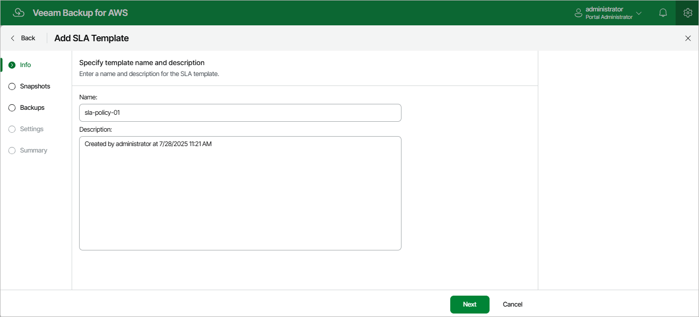

In this article

At the Info step of the wizard, use the Name and Description fields to enter a name for the new SLA template and to provide a description for future reference. The maximum length of the name is 127 characters; the maximum length of the description is 255 characters.

Page updated 11/21/2025

Page content applies to build 10.0.0.232
