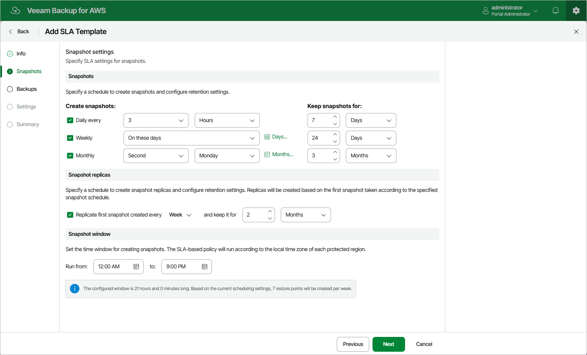

In this article

At the Snapshots step of the wizard, you can configure the following snapshot settings:

1. In the Snapshots section, you can instruct Veeam Backup for AWS to create cloud-native snapshots on a daily, weekly and monthly basis, and to keep the created snapshots in a snapshot chain for a specific number of days, months or years. If a snapshot is older than the specified time limit, Veeam Backup for AWS removes the snapshot from the chain.
2. In the Snapshot replicas section, you can instruct Veeam Backup for AWS to replicate cloud-native snapshots to other AWS accounts or regions on a daily, weekly and monthly basis, and to keep the created replicas in a snapshot replica chain for a specific number of days or months. If a snapshot replica is older than the specified time limit, Veeam Backup for AWS removes the snapshot replica from the chain.

|  |
| --- |
| Notes |
| * Snapshot replicas are always created based on the first snapshot taken according to the specified snapshot schedule.   Consider the following example. You configured an SLA template to create cloud-native snapshots 3 times a week (Monday, Wednesday and Friday) and to replicate a snapshot every week. In this case, Veeam Backup for AWS replicates the snapshot taken on Monday.   * When combining a daily snapshot replica schedule with a weekly snapshot schedule, keep in mind that Veeam Backup for AWS will create snapshot replicas on a daily basis only in case you select the Every day option or the On these days option with all days specified. |

1. In the Snapshot window section, you can instruct Veeam Backup for AWS to create daily snapshots within a specific time interval if you do not want backup operations to overlap production hours.

Veeam Backup for AWS automatically adjusts the specified snapshot window to the time zone of each AWS Region added to all SLA-based backup policies that have this SLA template assigned. For more information, see [Data Protection Windows](snapshot_backup_window.md).

When you combine multiple types of snapshot schedules, Veeam Backup for AWS re-uses snapshots created according to a more-frequent schedule (daily or weekly) to achieve the desired SLA compliance for less-frequent schedules (weekly and monthly). For example, if you configure a daily and a monthly schedule, the first daily snapshot successfully created on a day scheduled for the monthly snapshot will be marked as both a daily and a monthly snapshot.

Page updated 11/24/2025

Page content applies to build 10.0.0.232
