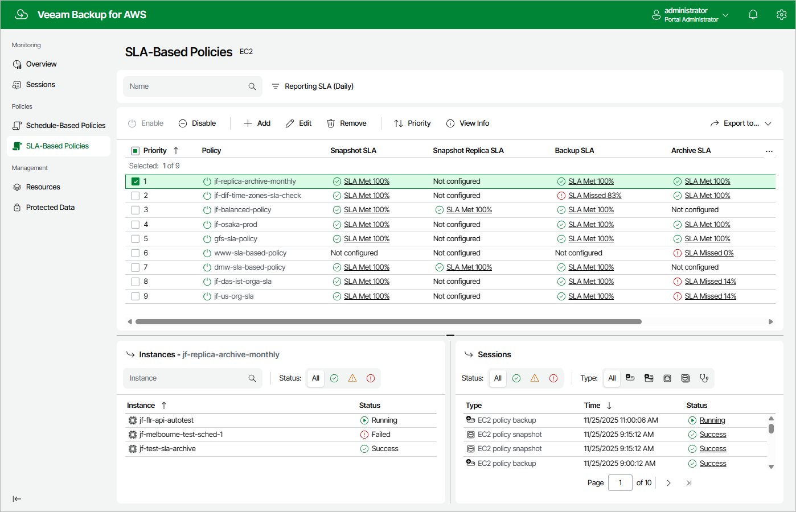

# Viewing SLA-Based Policy Details

After you create an SLA-based backup policy, Veeam Backup for AWS displays this policy on the SLA-Based Policies page. Each policy is described with the following set of properties:

* Priority — the priority of the policy.
* Policy — the name of the policy.
* Description — the reference information on the policy.
* Snapshot SLA — the most recent SLA compliance ratio calculated for all snapshots produced by the policy.
* Snapshot Replica SLA — the most recent SLA compliance ratio calculated for all snapshot replicas produced by the policy.
* Backup SLA — the most recent SLA compliance ratio calculated for all backups produced by the policy.
* Archive SLA — the most recent SLA compliance ratio calculated for all archived backups produced by the policy.

Each SLA compliance ratio on this page is calculated as an average for all EC2 instances that are added to the policy. To see how the SLA compliance ratio has been changing over a specific period (daily, monthly or weekly) for each EC2 instance protected by the policy, click the link in the Snapshot SLA, Snapshot Replica SLA, Backup SLA or Archive SLA column. For more information, see [Monitoring SLA-Based Policy Performance](sla_monitoring.md).

|  |
| --- |
| Tip |
| By default, Veeam Backup for AWS applies the Daily filtering condition to the created policies. To switch between the filtering conditions, click Reporting SLA. |

SLA Status

The SLA compliance ratio can acquire the following statuses:

| Status | Icon | Description |
| --- | --- | --- |
| Not configured | — | The SLA compliance ratio cannot be calculated as no corresponding backup schedule is configured in the SLA template applied to the policy. |
| Not available | — | The SLA compliance ratio has not been calculated yet. |
| SLA Met |  | The SLA compliance ratio equals or is greater than the target SLA value. |
| SLA Missed |  | The SLA compliance ratio is less than the target SLA value. |

To learn how the SLA compliance ratio is calculated, see [How Veeam Backup for AWS Estimates SLA Compliance](sla_calculation.md).

In This Section

[How Veeam Backup for AWS Estimates SLA Compliance](sla_calculation.md)

