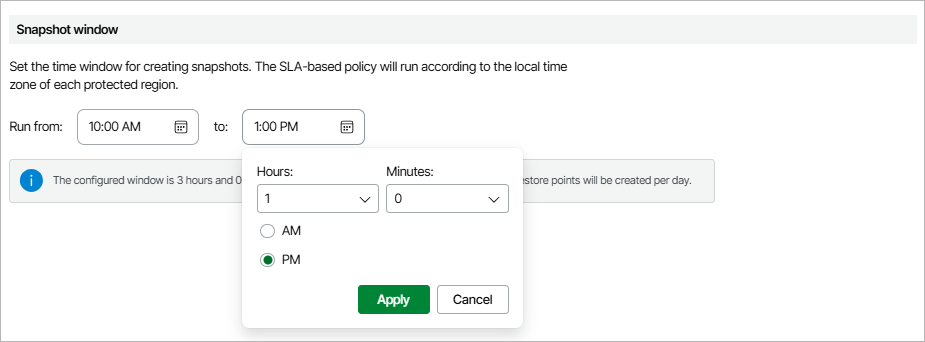

In this article

A data protection window is a time interval during which SLA-based backup policies are allowed to create restore points of protected resources. Data protection windows can be helpful if you do not want SLA-based backup policies to produce unwanted overhead for the production environment or do not want the policies to overlap production hours.

When you specify a data protection window for an SLA-based backup policy, Veeam Backup for AWS adjusts this window to the time zone of each AWS Region added to the policy. For example, if you instruct Veeam Backup for AWS to create daily snapshots of EC2 instances residing in the Asia Pacific (Singapore) and US West (Oregon) regions between 9:00 AM and 9:00 PM, Veeam Backup for AWS will create cloud-native snapshots in the following way:

1. At 9:00 AM Singapore time (01:00 UTC), Veeam Backup for AWS will start creating the first daily snapshot in the Asia Pacific (Singapore) region.
2. At 9:00 AM Oregon time (17:00 UTC), Veeam Backup for AWS will start creating the first daily snapshot in the US West (Oregon) region.

|  |
| --- |
| Note |
| If a running SLA-based backup policy exceeds the allowed data protection window, Veeam Backup for AWS will not stop the policy immediately and will continue creating restore points. |

Keep in mind that the value that you specify as the end of a data protection window is excluded from this window. For example, if you instruct Veeam Backup for AWS to create daily snapshots every hour between 10:00 AM and 1:00 PM, Veeam Backup for AWS will create 3 snapshots over this interval: at 10:00 AM, 11:00 AM and 12:00 PM. However, if you instruct Veeam Backup for AWS to create daily snapshots every hour between 10:00 AM and 1:05 PM, Veeam Backup for AWS will create 4 snapshots: at 10:00 AM, 11:00 AM, 12:00 PM and 1:00 PM.

Related Topics

[Adding SLA Templates](sla_add.md)

Page updated 11/21/2025

Page content applies to build 10.0.0.232
