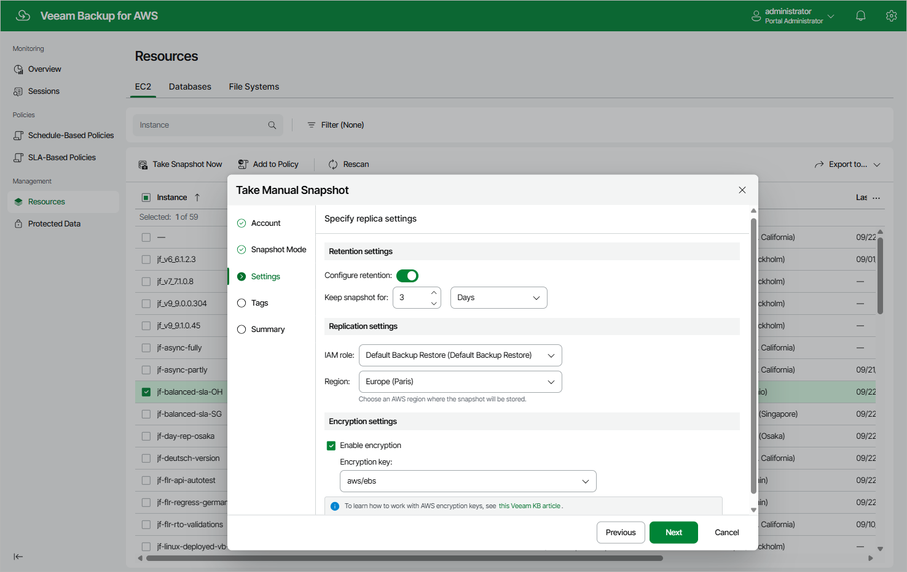

In this article

Veeam Backup for AWS allows you to manually create snapshots of EC2 instances. You can instruct Veeam Backup for AWS to store the created snapshots in the same AWS Regions where the processed EC2 instances reside, or in a different AWS Region or AWS account.

|  |
| --- |
| Note |
| Veeam Backup for AWS does not include snapshots created manually in the snapshot chain and does not apply the configured retention policy settings to these snapshots. |

To manually create a cloud-native snapshot of an EC2 instance, do the following:

1. Navigate to Resources > EC2.
2. Select the necessary instance and click Take Snapshot Now.

For an EC2 instance to be displayed in the list of available instances, an AWS Region where the instance resides must be added to any of [configured EC2 backup policies](add_policy_source_settings.md), and the IAM role specified in the backup policy settings or in the organization settings must have permissions to access the instance. For more information on the required permissions, see [EC2 Backup IAM Role Permissions](role_permissions_backup_ec2.md).

1. Complete the Take Manual Snapshot wizard:

1. At the Account step of the wizard, specify an IAM role whose permissions Veeam Backup for AWS will use to create the snapshot. The specified IAM role must belong to the same AWS account in which the processed EC2 instances reside.

For an IAM role to be displayed in the list of available roles, it must be added to Veeam Backup for AWS as described in section [Adding IAM Roles](iam_roles_add.md).

|  |
| --- |
| Important |
| Veeam Backup for AWS does not support taking manual snapshot using IAM roles specified in the [organization settings](organization_add_settings.md). |

1. At the Snapshot Mode step of the wizard, choose whether you want to store the snapshot in the same location where the processed EC2 instance resides, or in a new AWS Region and AWS account.

1. At the Settings step of the wizard, you can instruct Veeam Backup for AWS to keep the created snapshot for a specific number of days. If a snapshot is older than the specified time limit, Veeam Backup for AWS removes the snapshot from AWS automatically.

|  |
| --- |
| Tip |
| If required, you can remove the created snapshot manually as described in section [Managing Backed-Up EC2 Instance Data](backups_view_ec2.md). |

If you have selected the New location option at step 3b, you must also do the following:

1. In the Replication settings section, choose the target AWS Region in which the snapshot will be stored and specify an IAM role whose permissions will be used to replicate the snapshot. The specified IAM role must belong to the AWS account to which you want to replicate the snapshot.

For an IAM role to be displayed in the list of available roles, it must be added to Veeam Backup for AWS as described in section [Adding IAM Roles](iam_roles_add.md).

1. In the Encryption settings section, choose whether you want to encrypt the replicated snapshot with an AWS KMS key and specify the necessary KMS key.

For a KMS key to be displayed in the list of available encryption keys, it must be stored in the target AWS Region, and the IAM role specified for the replication operation must have permissions to access the key. For more information on KMS keys, see [AWS Documentation](https://docs.aws.amazon.com/kms/latest/developerguide/create-keys.html).

1. At the Tags step of the wizard, choose whether you want to assign AWS tags to the created snapshot:

* To assign already existing AWS tags from the EBS volumes of the processed EC2 instance, select the Copy tags from source volumes check box.

If you choose to copy tags from source volumes, Veeam Backup for AWS will first create a snapshot of the EC2 instance and assign to the created snapshot AWS tags with Veeam metadata, then Veeam Backup for AWS will copy tags from the volumes of the processed instance and, finally, assign the copied AWS tags to the snapshot.

* To assign your own custom AWS tags, click Add and specify the tags explicitly. To do that, in the Add Custom Tag window, specify a key and a value for the new AWS tag, and then click Apply. Note that you cannot add more than 5 custom AWS tags.

If you choose to add custom tags to created snapshots, Veeam Backup for AWS will assign the specified tags right after it creates a snapshot.

1. At the Summary step of the wizard, review configuration information, choose whether you want to proceed to the [Session Log page](reporting.md#ui) to track the progress of snapshot creation, and click Finish.

Page updated 9/22/2025

Page content applies to build 10.0.0.232
