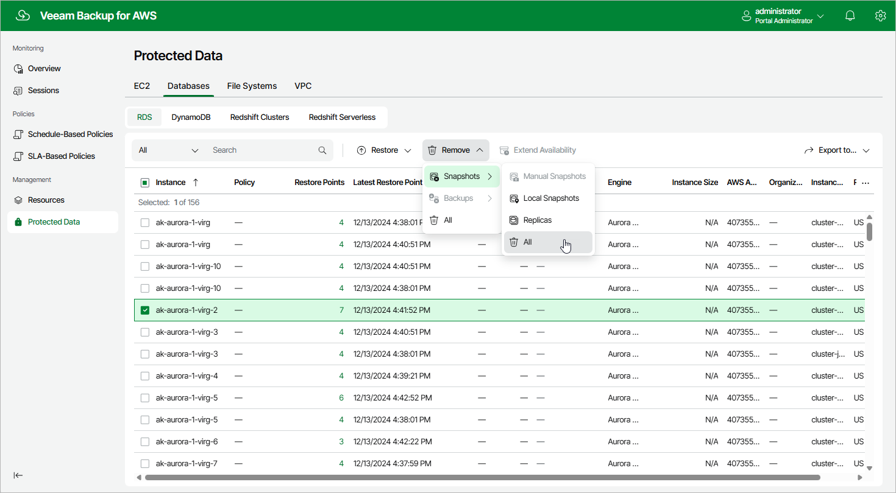

In this article

Veeam Backup for AWS applies the [configured retention policy settings](add_policy_schedule_retention_rds.md) to automatically remove cloud-native snapshots and snapshot replicas and image-level backups created by backup policies. If necessary, you can also remove the backed-up data manually.

|  |
| --- |
| Important |
| * Do not delete backup files from Amazon S3 buckets in the AWS Management Console. If some file in a backup chain is missing, you will not be able to roll back DB instance data to the necessary state.  * In Veeam Backup for AWS, you can remove only snapshots created by the Veeam backup service. To delete AWS Snapshots (DB instance snapshots and DB cluster snapshots created in AWS), use [Amazon Management Console](https://docs.aws.amazon.com/AmazonRDS/latest/UserGuide/USER_DeleteSnapshot.html). |

To remove backed-up data manually, do the following:

1. Navigate to Protected Data > Databases > RDS.
2. Select RDS resources whose data you want to remove.
3. Click Remove and select either of the following options:

* Snapshots > All — to remove all cloud-native snapshots and snapshot replicas created for the selected RDS resources both by backup policies and manually.
* Snapshots > Manual Snapshots — to remove cloud-native snapshots created for the selected RDS resources manually.

If you want to remove only specific cloud-native snapshots, follow the instructions provided in section [Removing Snapshots Created Manually](snapshots_remove_individual_rds.md).

* Snapshots > Local Snapshots — to remove cloud-native snapshots created for the selected RDS resources by backup policies.
* Snapshots > Replica — to remove snapshot replicas created for the selected RDS resources by backup policies.
* Backups > All — to remove all backups created for the selected RDS resources.
* Backups > Standard — to remove all standard backups created for the selected RDS resources.
* Backups > Archived — to remove all archived backups created for the selected RDS resources.

* All — to remove all cloud-native snapshots, snapshot replicas, and image-level backups created for the selected RDS resources both by backup policies and manually.

Page updated 12/11/2025

Page content applies to build 10.0.0.232
