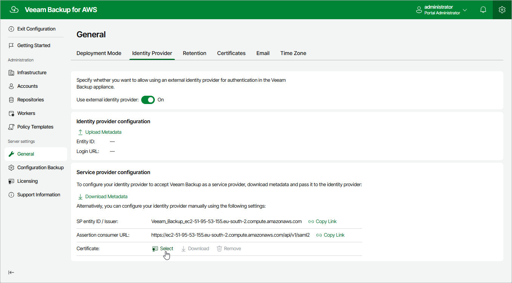

In this article

Veeam Backup for AWS supports single sign-on (SSO) authentication based on the SAML 2.0 protocol. SSO authentication scheme allows a user to log in to different software systems with the same credentials using the identity provider service.

To configure SSO settings for Veeam Backup for AWS, do the following:

1. Switch to the Configuration page.

1. Navigate to General > Identity Provider.

1. In the Identity Provider Configuration section, import identity provider settings from a file obtained from your identity provider:

1. Click Upload Metadata.
2. In the Upload Identity Provider Configuration window, click Browse to locate the file with the identity provider settings.
3. Click Upload.

1. Forward the service provider authentication settings to the identity provider — to obtain the settings, in theVeeam Backup for AWS Configuration section, click Download. Veeam Backup for AWS will download a metadata file with the service provider authentication settings to your local machine.

Alternatively, you can copy the service provider settings manually:

1. Click Copy Link in the SP Entity ID / Issuer field.
2. Click Copy Link in the Assertion Consumer URL field.

1. [Optional] If you want to sign and encrypt authentication requests sent from Veeam Backup for AWS to the identity provider, select a certificate with a private key that will be used to sign and encrypt the requests:

1. In the Veeam Backup for AWS Configuration section, click Select in the Certificate field.
2. In the Upload Veeam Backup certificate window, click Browse to locate the certificate file. In the Password field, specify a password used to open the file.
3. Click Upload.

|  |
| --- |
| Note |
| Veeam Backup for AWS supports certificates only in the .PFX and .P12 formats. |

After you configure SSO settings, you can add user accounts that will be able to log in to Veeam Backup for AWS using single sign-on. For more information, see [Adding User Accounts](accounts_vba_users_create.md).

|  |
| --- |
| Important |
| To authenticate a user whose identity has been received from the identity provider, Veeam Backup for AWS redirects the user to the identity provider portal. After the user logs in to the portal, the identity provider sends a SAML authentication response to Veeam Backup for AWS. The SAML response must contain the UserName attribute to allow Veeam Backup for AWS to identify the user. The attribute value must match the user name that you specify [when creating the user account](accounts_vba_users_create.md).  If your identity provider does not send the UserName attribute by default, you must create a claim rule on the identity provider side to send this attribute in the SAML authentication response to the Veeam Backup for AWS request. |

Page updated 7/4/2025

Page content applies to build 10.0.0.232
