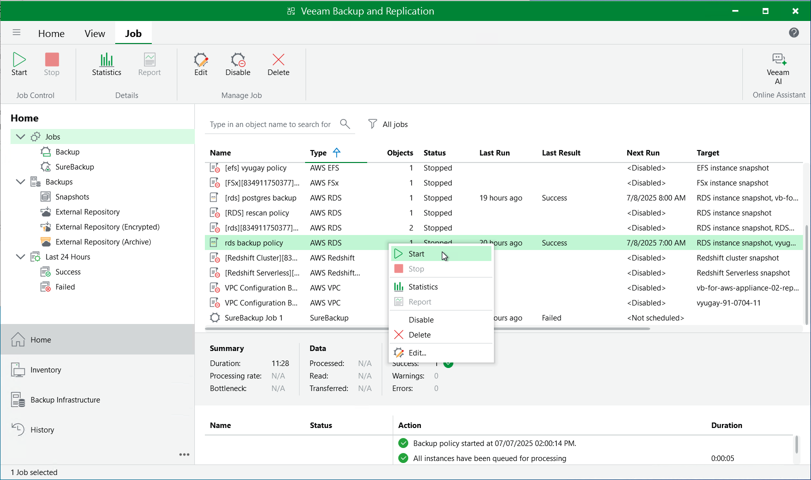

In this article

You can start a backup policy manually, for example, if you want to create an additional restore point in the snapshot or backup chain and do not want to modify the configured backup policy schedule. You can also stop a backup policy if processing of an instance is about to take too long, and you do not want the policy to have an impact on the production environment during business hours.

To start or stop a backup policy, do the following:

1. In the Veeam Backup & Replication console, open the Home view.
2. Navigate to Jobs.
3. Select the necessary backup policy, and click Start or Stop on the ribbon.

Alternatively, you can right-click the selected policy, and select Start or Stop.

Page updated 7/8/2025

Page content applies to build 10.0.0.232
