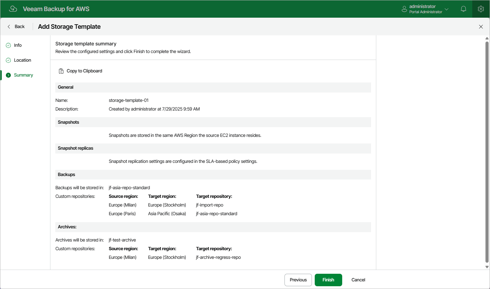

In this article

At the Summary step of the wizard, review summary information and click Finish.

|  |
| --- |
| Tip |
| After you create a storage template and assign it to a number of SLA-based backup policies as described in section [Creating SLA-Based EC2 Backup Policies](add_sla_policy_target_settings.md), you will be able to see the full list of all the related policies on the Storage page. To do that, select the necessary template and click the link in the Currently Assigned column. |

Page updated 11/21/2025

Page content applies to build 10.0.0.232
