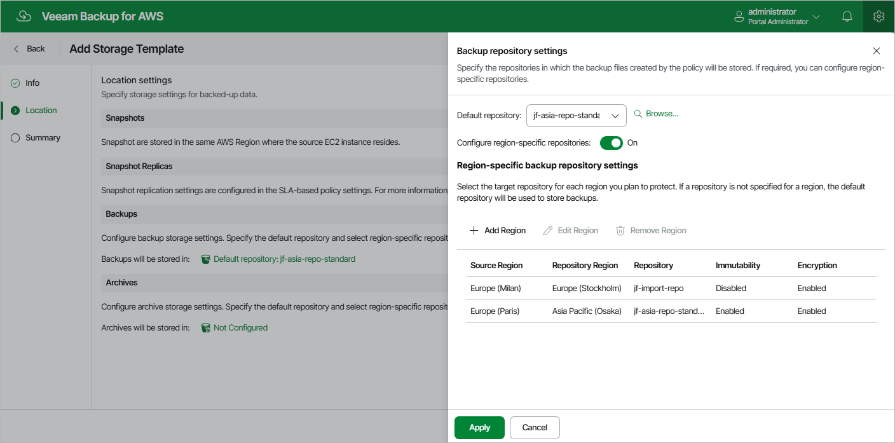

In this article

At the Location step of the wizard, you can specify target locations where Veeam Backup for AWS will keep restore points produced by all SLA-based backup policies that will have this storage template assigned.

|  |
| --- |
| Note |
| The Storage Template wizard does not allow you to configure location settings for cloud-native snapshots and snapshot replicas. By design, snapshots are stored in the same AWS Regions where the source EC2 instances reside, and you cannot change this behavior. However, you can use the Add SLA-Based Policy wizard to specify target locations for snapshot replicas — to do that, follow the instructions provided in section [Creating SLA-Based EC2 Backup Policies](add_sla_policy_snapshot_settings.md). |

To configure location settings for image-level backups, do the following:

1. Specify a target location (backup repository) where image-level backups will be stored. To do that, click the link in the Backups section. Then, select the necessary repository from the Default repository drop-down list in the Backup repository settings window.

By default, Veeam Backup for AWS will use the selected repository for all AWS Regions where the source EC2 instances reside. To instruct Veeam Backup for AWS to use separate repositories for each region:

1. Set the Configure region-specific repositories toggle to On.
2. In the Region-specific backup repository settings section, click Add Region.
3. In the Configure Region Settings window, choose a region and a repository that you want to use for this region.

For a backup repository to be displayed in the list of available repositories, it must be added to Veeam Backup for AWS as described in section [Managing Backup Repositories](repositories.md). If you have not added the repository to Veeam Backup for AWS beforehand, you can do it without closing the Select Repository and Configure Region Settings windows. To do that, click Add and complete the Add Repository wizard.

1. Specify a target location (archive backup repository) where archived backups will be stored. To do that, click the link in the Archives section. Then, select the necessary repository from the Default repository drop-down list in the Archive repository settings window.

By default, Veeam Backup for AWS will use the selected repository for all AWS Regions where the source EC2 instances reside. To instruct Veeam Backup for AWS to use separate repositories for each region:

1. Set the Configure region-specific repositories toggle to On.
2. In the Region-specific archive repository settings section, click Add Region.
3. In the Configure Region Settings window, choose a region and a repository that you want to use for this region.

For an archive backup repository to be displayed in the list of available repositories, it must be added to Veeam Backup for AWS as described in section [Managing Backup Repositories](repositories.md). If you have not added the repository to Veeam Backup for AWS beforehand, you can do it without closing the Select Repository and Configure Region Settings windows. To do that, click Add and complete the Add Repository wizard.

|  |
| --- |
| Important |
| * To be able to choose a target location for archived backups, you must specify a target location for image-level backups first. * Consider that data encryption must be either enabled or disabled for backup and archive backup repositories. This means that you cannot select an encrypted standard backup repository and an unencrypted archive backup repository in one storage template. However, the selected repositories can have different encryption schemes (password and KMS encryption). |

Page updated 11/24/2025

Page content applies to build 10.0.0.232
