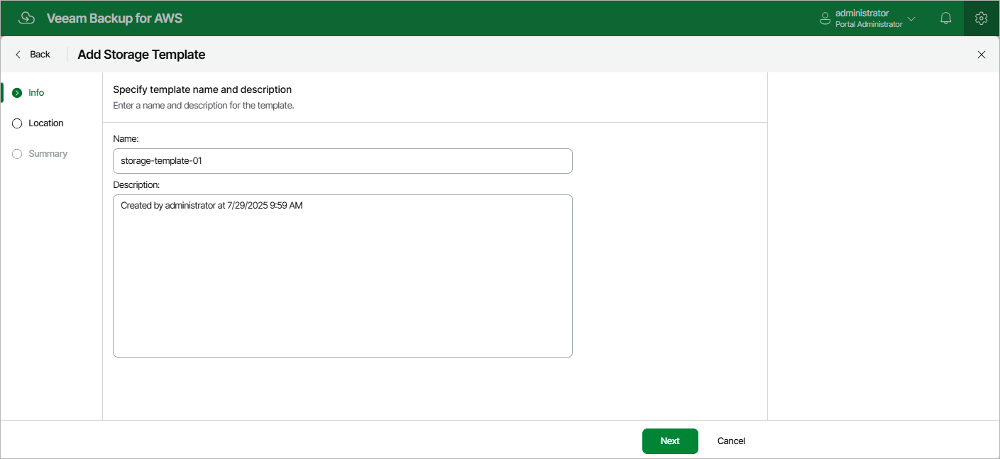

In this article

At the Info step of the wizard, use the Name and Description fields to enter a name for the new storage template and to provide a description for future reference. The maximum length of the name is 127 characters; the maximum length of the description is 255 characters. The following characters are not supported: / \ " ' : | < > + = ; , ? ! \* % # ^ @ & $ .

Page updated 7/29/2025

Page content applies to build 10.0.0.232
