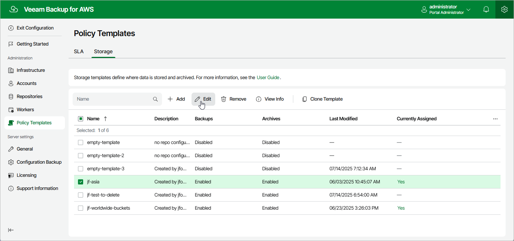

In this article

|  |
| --- |
| Important |
| If a storage template is already assigned to at least one SLA-based backup policy and Veeam Backup for AWS has already stored image-level backups in the specified location, modifying its location settings will cause Veeam Backup for AWS to start a new chain of restore points in this location. The old chain of restore points will be retained in the previous location until removed according to retention settings specified for the SLA template assigned to this SLA-based backup policy. |

For each storage template, you can modify settings configured while creating the template:

1. Switch to the Configuration page.
2. Navigate to Policy Templates > Storage and click Edit.
3. Complete the Edit Storage Template wizard:

1. To provide a new name and description for the template, follow the instructions provided in section [Adding Storage Templates](storage_add_name.md) (step 2).
2. To modify the configured location settings, follow the instructions provided in section [Adding Storage Templates](storage_add_location_settings.md) (step 3).
3. At the Summary step of the wizard, review configuration information and click Finish to confirm the changes.

|  |
| --- |
| Tip |
| After you click Finish, Veeam Backup for AWS will update the timestamp in the Last Modified column on the Storage page, regardless of whether you have actually modified the template settings or not. If you want to simply view the configured settings without making any changes, click View Info. |

Page updated 11/21/2025

Page content applies to build 10.0.0.232
