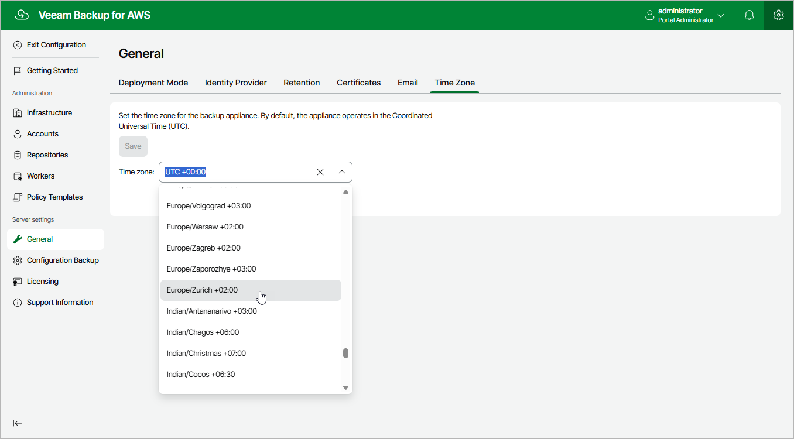

In this article

Veeam Backup for AWS runs daily reports and performs all data protection and disaster recovery operations according to the time zone set on the backup appliance. Since the backup appliance is deployed on an EC2 instance in Amazon EC2, the time zone is set to Coordinated Universal Time (UTC) by default. However, you can change the time zone if required. For example, you may want the time on the backup appliance to match the time on the workstation from which you access Veeam Backup for AWS.

To change the time zone set on the backup appliance:

1. Switch to the Configuration page.

1. Navigate to General > Time Zone.

1. Select the necessary time zone from the Time zone drop-down list.

1. Click Save.

|  |
| --- |
| Note |
| It is not recommended to change the time zone if any data protection or disaster recovery session is currently running. Wait for all the running sessions to complete or stop them manually — and then change the time zone. To learn how to track real-time statistics of all running and completed operations, see [Viewing Session Statistics](reporting.md#ui). |

Page updated 7/4/2025

Page content applies to build 10.0.0.232
