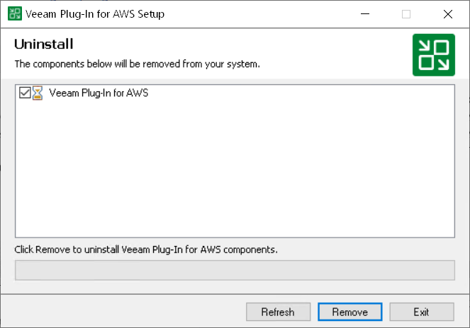

In this article

Before you uninstall Veeam Plug-In for AWS, it is recommended that you [remove all connected backup appliances](remove_appliance.md) from the backup infrastructure. If you keep the backup appliances in the backup infrastructure, the following will happen:

* You will be able to see information on snapshots of EC2 instances and RDS resources, as well as backups of DynamoDB tables, Redshift clusters, EFS file systems, FSx file systems, and VPC configurations in the Veeam Backup & Replication console. However, you will not be able to perform any operations with these snapshots and backups.

* You will be able to see information on image-level backups of EC2 and DB instances and perform data recovery operations using these backups. However, restore of entire EC2 instances to AWS will start working as described in the Veeam Backup & Replication User Guide, section [How Restore to Amazon EC2 Works](https://helpcenter.veeam.com/docs/vbr/userguide/restore_amazon_hiw.html?ver=13).

* You will be able to see information on backup policies. However, you will only be able to remove these policies from the Veeam Backup & Replication console.

To uninstall Veeam Plug-In for AWS, do the following:

1. Log in to the backup server using an account with local Administrator permissions.
2. Open the Start menu, navigate to Control Panel > Programs > Programs and Features.
3. In the program list, click Veeam Plug-In for AWS and click Uninstall.
4. In the opened window, click Remove.

|  |
| --- |
| Note |
| After you uninstall Veeam Plug-In for AWS, you will be no longer able to add backup appliances and new external repositories to the backup infrastructure. |

Page updated 12/4/2025

Page content applies to build 10.0.0.232
