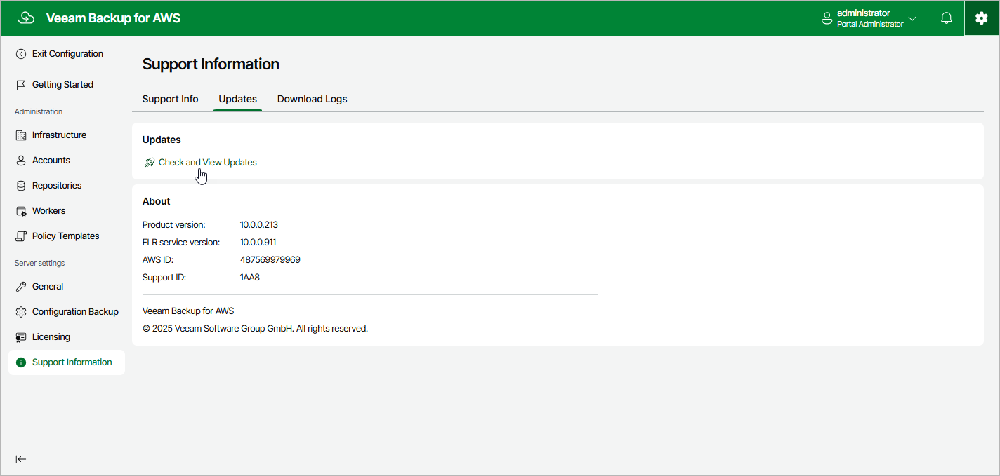
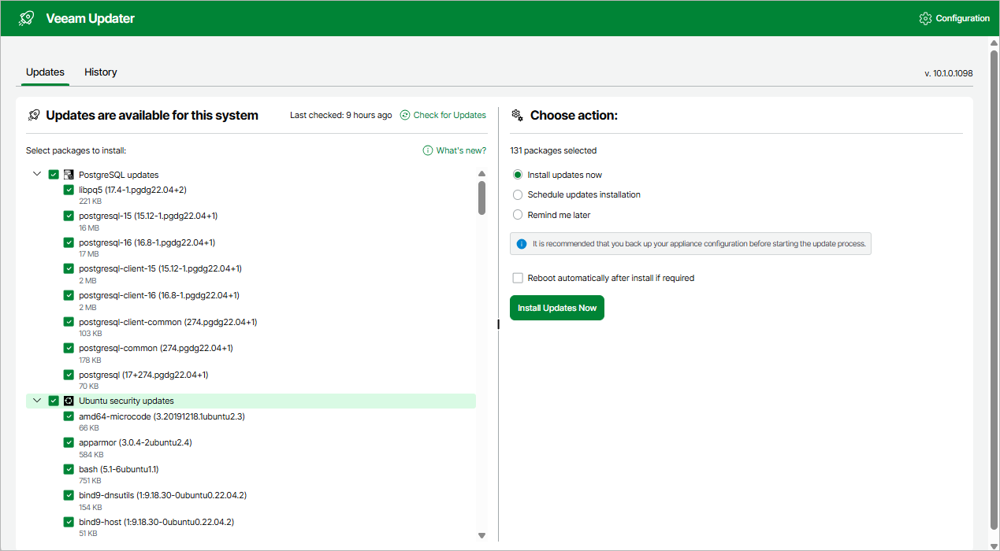

In this article

Veeam Backup for AWS automatically notifies you about newly released product versions, product updates, and software package updates available for the operating system running on the backup appliance. To learn which outbound internet access is required for the backup appliance to download information on available updates, see [Ports](ports.md#appliance).

If required, you can also check for available updates manually. To do that:

1. Switch to the Configuration page.
2. Navigate to Support Information > Updates.
3. Click Check and View Updates.

If new updates are available, Veeam Backup for AWS will display them on the Updates tab of the Veeam Updater page. To view detailed information on an update, select the check box next to the update and click What's new?

Related Topics

* [Installing Updates](updates_install.md)
* [Viewing Updates History](updates_history.md)

Page updated 11/6/2025

Page content applies to build 10.0.0.232
