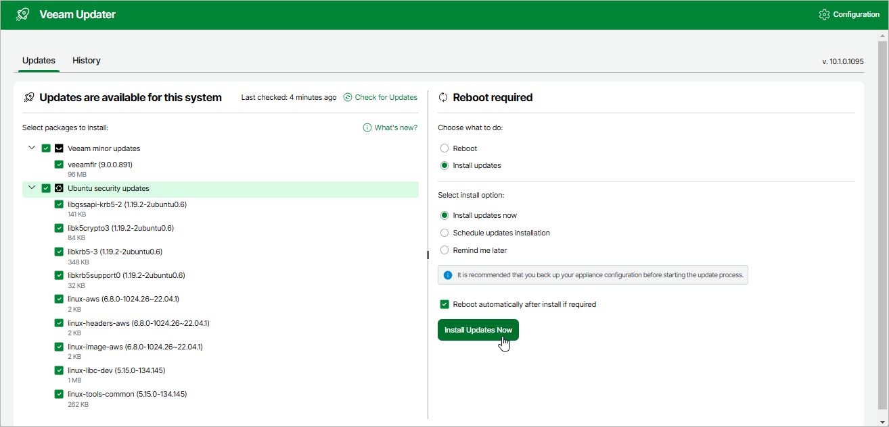
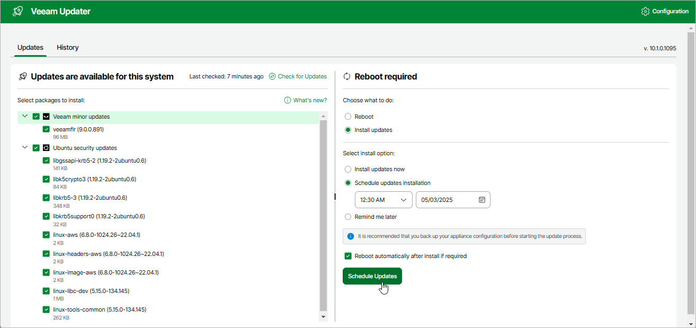
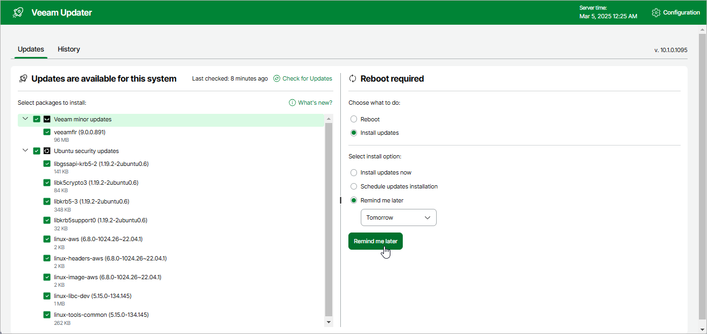

In this article

To download and install new available product and software package updates using the Veeam Updater service, you can use either of the following options:

* [Install updates immediately](#install)
* [Schedule update installation](#schedule)

You can also [set a reminder to send update notifications](#reminder).

|  |
| --- |
| Important |
| * Updating standalone backup appliances manually is not supported. You can update these appliances using the Veeam Updater service only.  * Installing software package updates on the backup appliance managed by a Veeam Backup for AWS server is supported using the Veeam Updater service only. |

Installing Updates

|  |
| --- |
| Important |
| Before you install a product update, make sure that all backup policies are both disabled and stopped, and no restore tasks are currently executing. Otherwise, the update process will interrupt the running activities, which may result in data loss. |

To download and install available product and software package updates:

1. Open the Veeam Updater page. To do that:

1. Switch to the Configuration page.
2. Navigate to Support Information.
3. On the Updates tab, click Check for Updates.

1. On the Veeam Updater page, do the following:

1. In the Updates are available for this system section, select check boxes next to the necessary updates.
2. In the Choose action section, select the Install updates now option, select the Reboot automatically after install if required check box to allow Veeam Backup for AWS to reboot the backup appliance if needed, and then click Install Updates Now.

|  |
| --- |
| Note |
| The updater may require you to read and accept the Veeam license agreement and licensing policy, as well as the license agreements of 3rd party components that Veeam incorporates, and the license agreements of required software. If you reject the agreements, you will not be able to continue installation. |

Veeam Backup for AWS will download and install the updates; the results of the installation process will be displayed on the History tab. Keep in mind that it may take several minutes for the installation process to complete.

|  |
| --- |
| Note |
| When installing product and software package updates, Veeam Backup for AWS restarts all services running on the backup appliance, including the Web UI service. That is why Veeam Backup for AWS will log you out when the update process completes. |

Scheduling Update Installation

You can instruct Veeam Backup for AWS to automatically download and install available product and software package updates on a specific date at a specific time:

1. On the Veeam Updater page, in the Updates are available for this system section, select check boxes next to the necessary updates.
2. In the Choose action section, do the following:

1. Select the Schedule updates installation option and configure the necessary schedule.

|  |
| --- |
| Important |
| When selecting a date and time when updates must be installed, make sure no backup policies are scheduled to run on the selected time. Otherwise, the update process will interrupt the running activities, which may result in data loss. |

1. Select the Reboot automatically after install if required check box to allow Veeam Backup for AWS to reboot the backup appliance if needed.
2. Click Schedule Updates.

Veeam Backup for AWS will automatically download and install the updates on the selected date at the selected time; the results of the installation process will be displayed on the History tab.

Setting Update Reminder

If you have not decided when to install updates, you can set an update reminder — instruct Veeam Backup for AWS to send an update notification later.

To do that, on the Veeam Updater page, in the Choose action section, do the following:

1. Select the Remind me later option and choose when you want to receive the reminder.

If you select the Next Week option, Veeam Backup for AWS will send the reminder in a week.

1. Click Remind me later.

Related Topics

[Viewing Updates History](updates_history.md)

Page updated 9/29/2025

Page content applies to build 10.0.0.232
