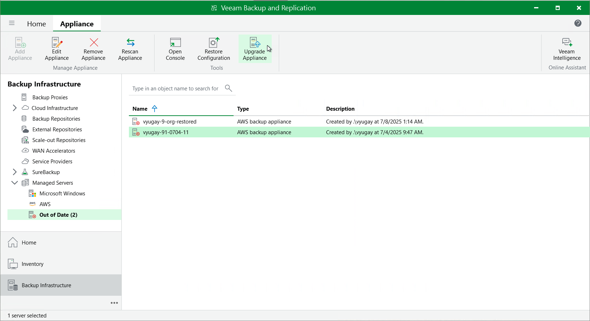

In this article

Starting from version 6a, you can upgrade backup appliances from the Veeam Backup & Replication console only. Upgrade to Veeam Backup for AWS version 10 is supported from Veeam Backup for AWS version 4 or later. To upgrade from an earlier version, you must first perform upgrade to version 4 as described in section [Installing Updates](updates_install.md).

|  |
| --- |
| Important |
| Before you upgrade a backup appliance, check whether the Veeam Backup for AWS version is compatible with the current version of Veeam Plug-In for AWS. For more information, see [System Requirements](system_requirements.md#versions). |

Veeam Plug-In for AWS allows you to download and install new available Veeam Backup for AWS versions and product updates:

1. In the Veeam Backup & Replication console, open the Backup Infrastructure view.
2. Navigate to Managed Servers.
3. Select the necessary backup appliance and click Upgrade Appliance on the ribbon.

Alternatively, right-click the appliance and select Upgrade.

If you remove the upgraded backup appliance that previously used a marketplace license, then you will no longer be able to switch to the Paid marketplace license, and the appliance will operate using the Free marketplace license. For more information on license editions, see [Licensing](licensing.md).

|  |
| --- |
| Note |
| When you upgrade to Veeam Backup for AWS version 10 from Veeam Backup for AWS version 6 or earlier, the backup appliance operating system is upgraded to Ubuntu 22.04 LTS and the configuration database is upgraded to PostgreSQL 15. For more information on the upgrade process, see [Upgrading to Version 10 from Version 6 or Earlier](upgrade_vb_console.md). |

Updating Default Backup Restore IAM Role

During upgrade, Veeam Backup & Replication updates only the permissions of the Default Backup Restore IAM role created on the backup appliance during installation. Depending on the version running on the appliance, the following will happen:

* If you upgrade to version 10 from Veeam Backup for AWS version 6a and earlier, Veeam Backup & Replication will assign all existing permissions to the role.
* If you upgrade to version 10 from Veeam Backup for AWS version 7, Veeam Backup & Replication will update only the permissions that were previously selected for the role in the [Add IAM Role](iam_roles_specify_permissions.md) wizard.

To learn how to modify permissions of the Default Backup Restore IAM role, see [Editing IAM Role Settings](iam_roles_edit.md).

Page updated 9/29/2025

Page content applies to build 10.0.0.232
