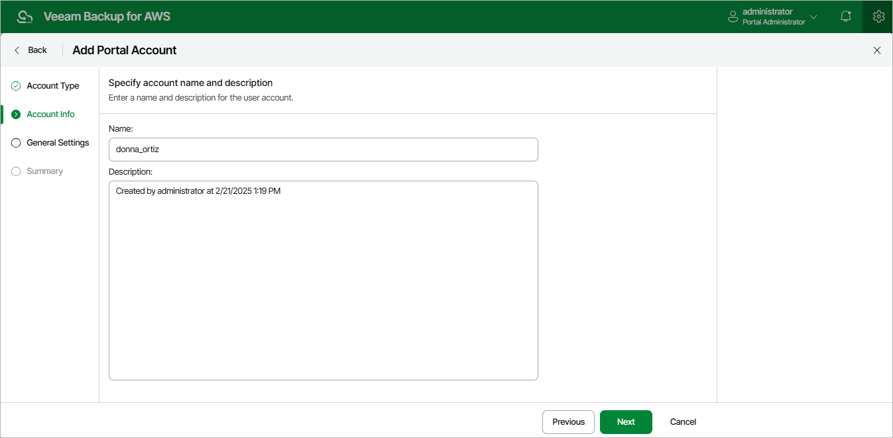

In this article

At the Account Info step of the wizard, use the Name and Description fields to enter a name for the new user account and to provide a description for future reference. The maximum length of the name is 32 characters for the Veeam Backup for AWS user and 125 characters for the user identity from your identity provider. The following characters are supported: lowercase Latin letters, numeric characters, underscores and dashes; the dollar sign ($) is supported but only if it the last character of the name.

|  |
| --- |
| Important |
| * You cannot use admin as the account name. * If you have selected the Identity Provider account option at step 1, the name specified for a user account must match the value of an attribute that the identity provider will send to Veeam Backup for AWS to authenticate the user. For more information, see [Configuring SSO Settings](sso_settings.md#IdpAttribute). |

Page updated 8/20/2025

Page content applies to build 10.0.0.232
