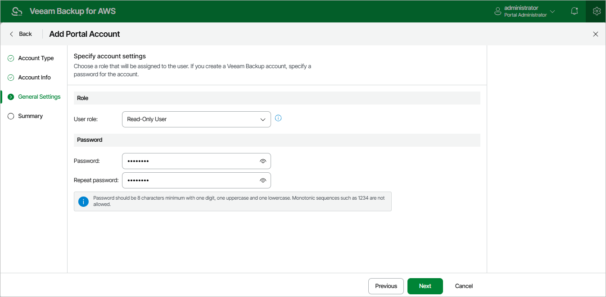

In this article

At the General Settings step of the wizard, select a role for the user account. For more information on user roles, see [Managing User Accounts](accounts_vba_users.md).

If you have selected the Veeam Backup for AWS account option at step 2, specify a password for the new Veeam Backup for AWS user account.

Page updated 8/20/2025

Page content applies to build 10.0.0.232
