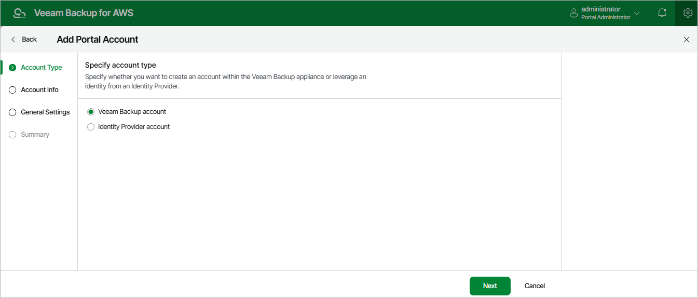

In this article

At the Account Type step of the wizard, choose whether you want to create a new Veeam Backup for AWS user or to retrieve a user identity from your identity provider. To retrieve user identities from the identity provider, you must first [configure single sign-on settings](sso_settings.md).

Page updated 8/20/2025

Page content applies to build 10.0.0.232
