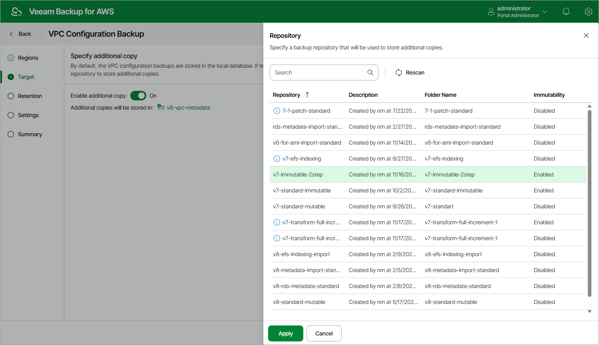

In this article

By default, Veeam Backup for AWS stores VPC configuration backups in the Veeam Backup for AWS database. You can instruct Veeam Backup for AWS to save additional VPC configuration backup copies to a backup repository. To do that:

1. At the Target step of the wizard, set the Enable additional copy toggle to On.
2. In the Repository window, select a backup repository that will be used to store the additional configuration backup copies.

For a backup repository to be displayed in the Repository list, it must be added to Veeam Backup for AWS as described in section [Adding Backup Repositories Using Web UI](repositories_add_ui.md). The list shows only backup repositories of the S3 Standard storage class.

1. To save changes made to the backup policy settings, click Apply.

|  |
| --- |
| Note |
| When choosing a backup repository, consider the following:   * If you want to encrypt the backed-up VPC configuration data, select a repository with encryption enabled. * If you want to make the backed-up VPC configuration data immutable for the period specified in [retention settings](vpc_policy_retention.md) of the backup policy, select a repository with immutability enabled. Note that Veeam Backup for AWS does not apply generations to VPC backups.   For more information on encryption and immutability, see [Adding Backup Repositories Using Web UI](repositories_add_ui.md). |

Page updated 8/21/2025

Page content applies to build 10.0.0.232
