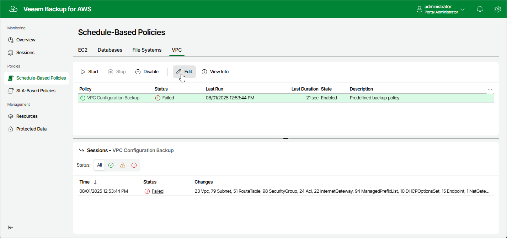

In this article

To launch the VPC Configuration Backup wizard, do the following:

1. Navigate to Schedule-Based Policies > VPC.
2. Click Edit.

Page updated 1/13/2026

Page content applies to build 10.0.0.232
