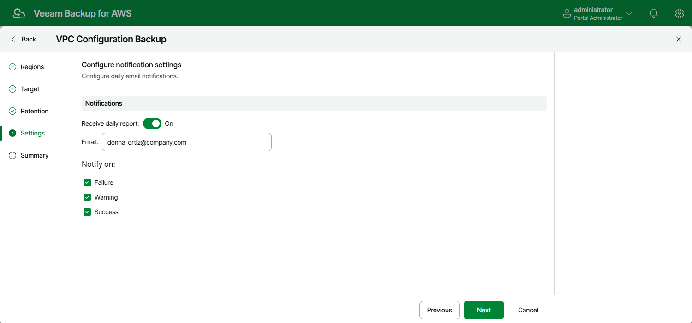

In this article

At the Settings step of the wizard, you can specify email notification settings for the VPC Backup policy.

|  |
| --- |
| Note |
| If you want to receive daily reports and email notifications on the VPC Configuration Backup policy results, you must configure [global notification settings](email_settings.md) first. |

To instruct Veeam Backup for AWS to send email notifications for the backup policy, do the following:

1. In the Notifications section, set the Receive daily report toggle to On.

1. In the Email field, specify an email address of a recipient.

Use a semicolon to separate multiple recipient addresses. Do not use spaces after semicolons between the specified email addresses.

1. Use the Notify on list to choose whether you want Veeam Backup for AWS to send email notifications in case the backup policy completes successfully, completes with warnings or completes with errors.

|  |
| --- |
| Note |
| If you specify the same email recipient in both backup policy notification and [global notification settings](email_settings.md), Veeam Backup for AWS will override the configured global notification settings and will send each notification to this recipient only once to avoid notification duplicates. |

Page updated 8/21/2025

Page content applies to build 10.0.0.232
