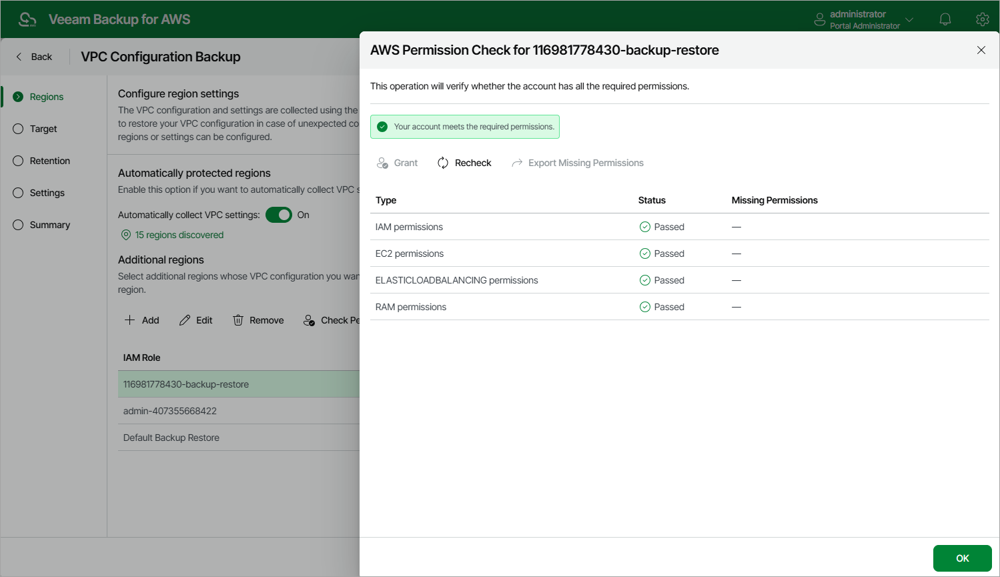

In this article

To instruct Veeam Backup for AWS to protect VPC configuration of all AWS Regions specified in EC2, RDS, DynamoDB, Redshift Clusters, Redshift Serverless, EFS and FSx backup policy settings, in the Automatically protected regions section, set the Automatically collect VPC settings toggle to On. To retrieve VPC configurations of all automatically protected AWS Regions, Veeam Backup for AWS will use the permissions of IAM roles specified either in the [organization settings](organization_add_settings.md) (if you back up resources within an AWS Organization), or in the backup policy settings (if you back up resources belonging to a single AWS account).

It is recommended that you check whether IAM roles specified in the backup policy settings have all the permissions required to perform Amazon VPC configuration backup. If some permissions of the IAM role are missing, the backup policy will fail. To run the IAM role permission check, do the following:

1. In the Automatically Protected Regions section, click the Discovered regions link.
2. In the Discovered regions window, select the IAM role whose permissions you want to check.
3. Click Check Permissions.

Veeam Backup for AWS will display the AWS Permission Check window where you can view the progress and results of the performed check. If some permissions of the IAM role are missing, the check will complete with errors. You can view the list of permissions that must be granted to IAM roles in the Missing Permissions column. For more information on the required permissions, see [VPC Configuration Backup IAM Role Permissions](role_permissions_backup_vpc.md).

You can grant the missing permissions to IAM roles in the AWS Management Console or instruct Veeam Backup for AWS to do it. To learn how to grant permissions to IAM roles using the AWS Management Console, see [AWS Documentation](https://docs.aws.amazon.com/IAM/latest/UserGuide/access_policies_manage-attach-detach.html). To let Veeam Backup for AWS grant the missing permissions:

1. In the AWS Permission Check window, click Grant.
2. In the Grant Permissions Window, provide one-time access keys of an IAM user that is authorized to update permissions of the IAM role, and then click Apply.

The IAM user whose access keys are used to update the IAM role must have the following permissions:

|  |
| --- |
| "iam:AttachRolePolicy",  "iam:CreatePolicy",  "iam:CreatePolicyVersion",  "iam:CreateRole",  "iam:GetAccountSummary",  "iam:GetPolicy",  "iam:GetPolicyVersion",  "iam:GetRole",  "iam:ListAttachedRolePolicies",  "iam:ListPolicyVersions",  "iam:SimulatePrincipalPolicy",  "iam:UpdateAssumeRolePolicy" |

|  |
| --- |
| Important |
| * Veeam Backup for AWS does not store one-time access keys in the configuration database. * Veeam Backup for AWS does not support checking permissions of the IAM roles specified in the organization settings using the built-in wizard permission check.  * If your organization uses service control policies (SCPs) to manage permissions in its accounts and these policies include any conditions, Veeam Backup for AWS will not be able to perform the IAM role permission check. This is the expected behavior caused by [AWS limitations](https://docs.aws.amazon.com/IAM/latest/UserGuide/access_policies_testing-policies.html#:~:text=You%20can%27t%20test%20service%20control%20policies%20(SCPs)%20with%20any%20conditions). |

Page updated 12/2/2025

Page content applies to build 10.0.0.232
