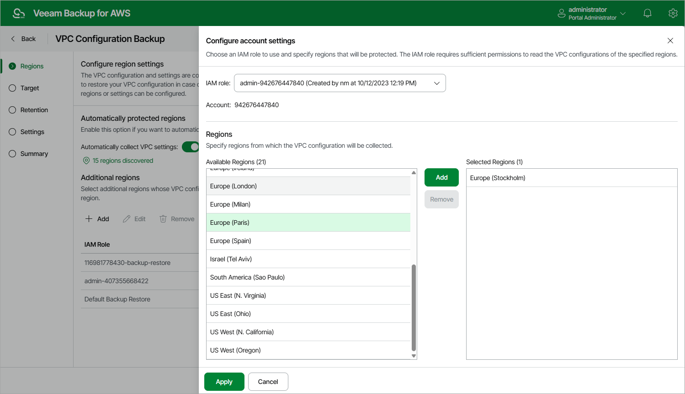

In this article

To add an AWS Region to the VPC Backup policy, or to choose another IAM role for collecting VPC configuration data, do the following:

1. In the Additional regions section, click Add.
2. In the Configure account settings window, from the IAM role drop-down list, select an IAM role whose permissions Veeam Backup for AWS will use to perform Amazon VPC configuration backup. In the Account field, the ID of the AWS account in which the IAM role was created will be displayed. The specified IAM role must be assigned the permissions listed in section [VPC Configuration Backup IAM Role Permissions](role_permissions_backup_vpc.md).

For an IAM role to be displayed in the list of available roles, it must be added to Veeam Backup for AWS with the Amazon VPC Backup operation selected as described in section [Adding IAM Roles](iam_roles_add.md).

1. In the Regions section, select the necessary AWS Regions from the Available Regions list on the left, and then click Add.

1. To save changes made to the backup policy settings, click Apply.
2. To check whether IAM role specified for the selected AWS Regions has all the permissions required to perform Amazon VPC configuration backup, in the Additional regions section, click Check Permissions.

Veeam Backup for AWS will display the AWS Permission Check window where you can view the progress and results of the performed check. If some permissions of the IAM role are missing, the check will complete with errors. You can view the list of permissions that must be granted to IAM roles in the Missing Permissions column. For more information on required permissions, see [VPC Configuration Backup IAM Role Permissions](role_permissions_backup_vpc.md).

You can grant the missing permissions to IAM roles in the AWS Management Console or instruct Veeam Backup for AWS to do it. To learn how to grant permissions to IAM roles using the AWS Management Console, see [AWS Documentation](https://docs.aws.amazon.com/IAM/latest/UserGuide/access_policies_manage-attach-detach.html). To let Veeam Backup for AWS grant the missing permissions:

1. In the AWS Permission Check window, click Grant.
2. In the Grant Permissions Window, provide one-time access keys of an IAM user that is authorized to update permissions of the IAM role, and then click Apply.

The IAM user whose access keys are used to update the IAM role must have the following permissions:

|  |
| --- |
| "iam:AttachRolePolicy",  "iam:CreatePolicy",  "iam:CreatePolicyVersion",  "iam:CreateRole",  "iam:GetAccountSummary",  "iam:GetPolicy",  "iam:GetPolicyVersion",  "iam:GetRole",  "iam:ListAttachedRolePolicies",  "iam:ListPolicyVersions",  "iam:SimulatePrincipalPolicy",  "iam:UpdateAssumeRolePolicy" |

|  |
| --- |
| Note |
| Veeam Backup for AWS does not store one-time access keys in the configuration database. |

Page updated 8/21/2025

Page content applies to build 10.0.0.232
