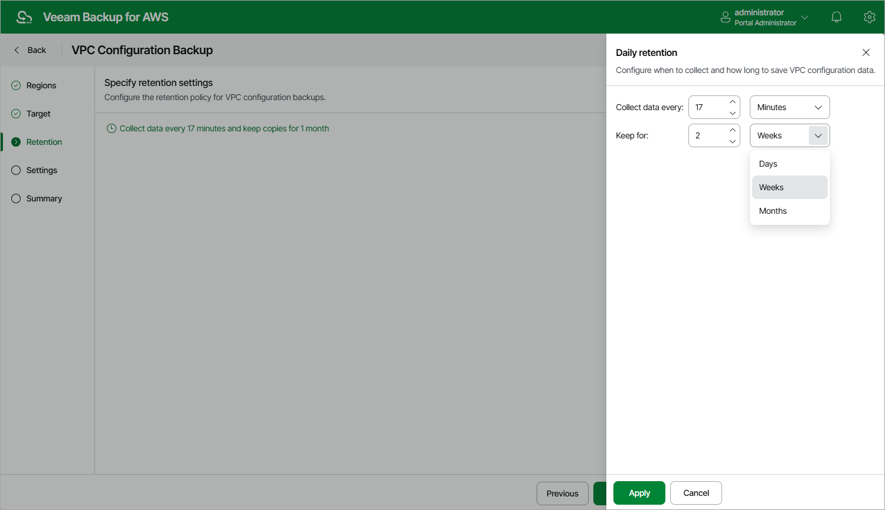

In this article

At the Retention step of the wizard, specify retention settings for VPC configuration backups:

1. Click the Collect data link.
2. In the Daily retention window, specify how often the data will be backed up and for how long the backups will be stored.

If a restore point is older than the specified time limit, Veeam Backup for AWS removes the restore point from the backup chain. For more information, see [VPC Configuration Backup Retention](retention_backup_vpc.md).

|  |
| --- |
| Note |
| Veeam Backup for AWS applies the retention settings configured for the VPC Configuration Backup policy both to VPC configuration backups stored in the Veeam Backup for AWS database and to VPC configuration backups stored in the backup repository selected for the policy. For VPC configuration backups stored in backup repositories that are not specified in the VPC Configuration Backup policy settings, Veeam Backup for AWS applies retention settings saved in the backup metadata. |

Page updated 8/21/2025

Page content applies to build 10.0.0.232
