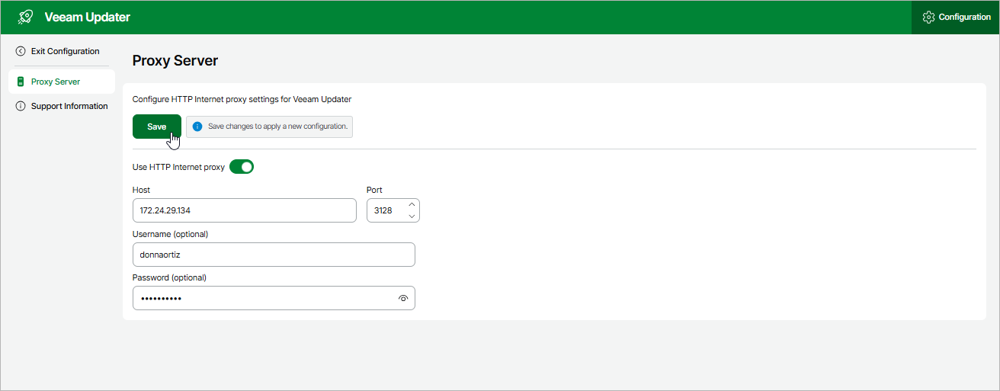

In this article

To check for available software package updates for Veeam Backup for AWS, the Veeam Updater service running on the backup appliance connects to the Veeam Update Repository over the internet. If the backup appliance is not connected to the internet, you can instruct Veeam Backup for AWS to use an HTTP proxy that will allow Veeam Updater to access to the required resources.

To configure connection to the internet through an HTTP proxy, do the following:

1. Open the Veeam Updater page:

1. Switch to the Configuration page.
2. Navigate to Support Information.
3. On the Updates tab, click Check and View Updates.

1. On the Veeam Updater page:

1. Switch to the Configuration page.
2. Navigate to Proxy Server.
3. Set the Use HTTP Internet proxy toggle to On.
4. In the Host field, enter the IP address or FQDN of the proxy.
5. In the Port field, enter the port used on the proxy for HTTP connections.
6. [Applies only if the HTTP proxy requires authentication] In the Username and Password fields, enter credentials of the user account configured on the proxy to access the internet.
7. Click Save.

|  |
| --- |
| Important |
| * You cannot modify the HTTP proxy settings during checking for updates. * Veeam Backup for AWS does not support access to resources through HTTPS proxy. |

Page updated 9/29/2025

Page content applies to build 10.0.0.232
