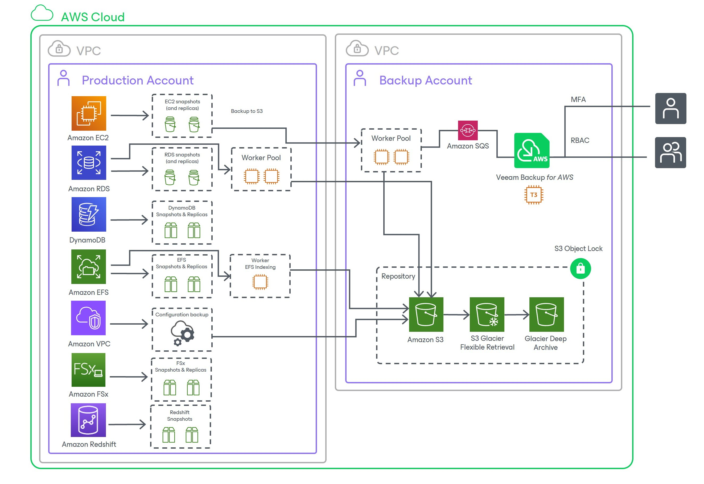

In this article

Veeam Backup for Amazon Web Services (Veeam Backup for AWS) is a solution developed for protection and disaster recovery tasks for AWS environments: Amazon Elastic Compute Cloud (EC2), Amazon Relational Database Service (RDS), Amazon Redshift, Amazon DynamoDB, Amazon Elastic File System (EFS) and Amazon FSx File System. Veeam Backup for AWS also allows you to back up and restore Amazon Virtual Private Cloud (VPC) configurations.

With Veeam Backup for AWS, you can perform the following data protection and disaster recovery operations:

* Create cloud-native snapshots of EC2 instances and RDS resources (DB instances and Amazon Aurora DB clusters).
* Replicate cloud-native snapshots to any AWS Region within any AWS account.
* Create image-level backups of EC2 instances and keep them in Amazon Simple Storage Service (Amazon S3) for high availability, cost-effective and long-term storage.
* Create cloud-native backups of EFS file systems and store them in any backup vault in the source AWS Region.
* Create backup copies of EFS file systems and store them in any AWS Region within the same AWS account.
* Create backups of VPC configurations and keep them in the Veeam Backup for AWS database and in Amazon S3.
* Create backups of the Veeam Backup for AWS configuration database.

* Restore entire EC2 instances, EC2 instance volumes, as well as EC2 instance files and folders.
* Restore RDS DB instances and Aurora DB clusters.
* Restore entire EFS file systems, as well as EFS files and directories.
* Restore entire VPC configurations of AWS Regions, as well as specific items of VPC configurations of AWS Regions.

* Restore the Veeam Backup for AWS configuration database to the same or another backup appliance.

For backup appliances managed by Veeam Backup & Replication, you can perform the following operations:

* Create image-level backups of Microsoft SQL Server and PostgreSQL DB instances and keep them in Amazon Simple Storage Service (Amazon S3) for high availability, cost-effective and long-term storage.
* Create cloud-native backups of DynamoDB tables and store them in any backup vault in the source AWS Region.
* Create backup copies of DynamoDB tables and store them in any AWS Region within the same AWS account.
* Create cloud-native backups of Redshift clusters and store them in any backup vault in the source AWS Region.
* Create cloud-native backups of Redshift Serverless namespaces.
* Create cloud-native backups of FSx file systems and store them in any backup vault in the specific AWS Regions.
* Create backup copies of FSx file systems and store them in specific AWS Regions within the same AWS account.

* Restore databases of Microsoft SQL Server and PostgreSQL DB instances.
* Restore DynamoDB tables, Redshift clusters, Redshift Serverless namespaces and FSx file systems.
* Restore entire EC2 instances to Microsoft Azure, Google Cloud and Nutanix AHV.
* Perform Instant Recovery of EC2 instances to VMware vSphere and Hyper-V environments, and to Nutanix AHV clusters.

|  |
| --- |
| Important |
| * Veeam Backup for AWS is available only in AWS Global and AWS GovCloud (US) regions.  * Starting from version 7.0, Veeam Backup for AWS is part of the Veeam Backup & Replication solution, and some new features are available only for backup appliances managed by Veeam Backup & Replication. For more information, see [Integration with Veeam Backup & Replication](integration_vbr.md). |

Page updated 1/8/2026

Page content applies to build 10.0.0.232
