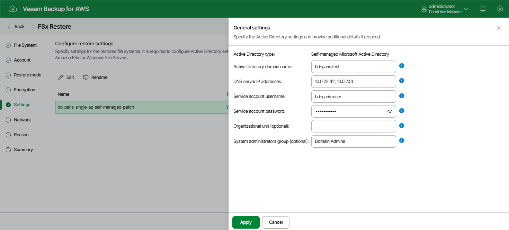

In this article

[This step applies only if you have selected the Restore to new location, or with different settings option at the Restore Mode step of the wizard]

At the Settings step of the wizard, you can provide a new name and specify Active Directory details for the restored file system, depending on the file system type:

* To specify a new name, select the file system and click Rename. In the File system name window, specify the name and click Apply.
* To specify Active Directory settings for an Amazon FSx for Windows File Server file system with AWS Managed Microsoft AD, select the file system and click Edit. Then, in the General Settings window, do the following:

1. From the Active Directory drop-down list, select the AWS Managed Microsoft AD to which the restored file system will be joined.

For an AWS Managed Microsoft AD to be displayed in the list of available directories, it must be created in the AWS Region specified at [step 4](restore_mode_fsx.md) of the wizard as described in [AWS Documentation](https://docs.aws.amazon.com/directoryservice/latest/admin-guide/ms_ad_getting_started.html#ms_ad_getting_started_create_directory).

1. To save changes made to the file system settings, click Apply.

* To specify Active Directory settings for an Amazon FSx for Windows File Server file system with self-managed Microsoft AD, select the file system and click Edit. Then, in the General Settings window, do the following:

1. In the Active Directory domain name filed, enter the domain name of an AD to which file system will be joined.
2. In the DNS server IP addresses field, enter the IPv4 address of DNS servers configured for the domain.
3. In the Service account username field, enter the name for a service account (without a domain prefix or suffix) that has access to the restored file system.
4. In the Service account password filed, enter the password of the service account.
5. [Optional] In the Organizational unit filed, enter the path name of an organizational unit in which you want to connect your file system.
6. [Optional] In the System administrators group filed, enter the name of an AD group that has privileges to manage the restored file system.
7. Click Apply.

|  |
| --- |
| Note |
| Veeam Backup for AWS does not store client secrets in the configuration database. |

For more information on Microsoft Active Directory in FSx for Windows File Server, see [AWS Documentation](https://docs.aws.amazon.com/fsx/latest/WindowsGuide/aws-ad-integration-fsxW.html).

Page updated 10/1/2025

Page content applies to build 10.0.0.232
