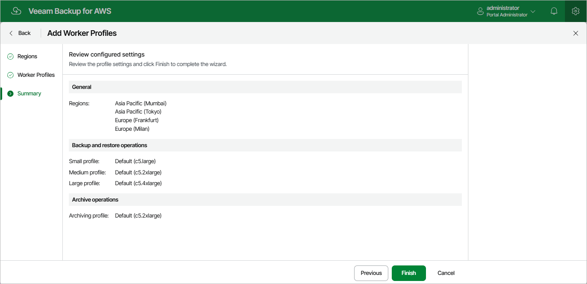

In this article

For each AWS Region in which worker instances will be deployed, you can add a custom set of worker profiles:

1. Switch to the Configuration page.

1. Navigate to Workers > Profile and click Add.
2. Complete the Add Worker Profiles wizard.

1. At the Regions step of the wizard, select regions for which you want to specify worker profiles and click Add.
2. At the Worker Profiles step of the wizard, choose profiles that will be used to deploy workers in the selected regions. To help you choose, tables in the Choose instance type section will provide information on the number of vCPU cores and the amount of system RAM for each available instance type.

For the full description of instance types that can be used to deploy EC2 instances in AWS, see [AWS Documentation](https://docs.aws.amazon.com/AWSEC2/latest/UserGuide/instance-types.html).

1. At the Summary step of the wizard, review summary information and click Finish.

As soon as you click Finish, Veeam Backup for AWS will create a separate set of worker profiles for each of the selected regions.

Page updated 7/4/2025

Page content applies to build 10.0.0.232
