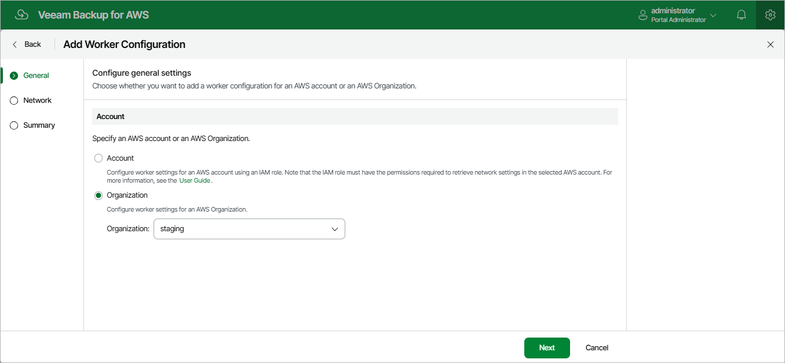

In this article

At the General step of the wizard, select either of the following options:

* Select the Organization option if you want to add a worker configuration for an AWS Organization. Then, select an organization managing resources that will be processed by workers instances deployed based on the new worker configuration. To retrieve network settings of all AWS Regions within the selected organization, Veeam Backup for AWS will use the permissions of the IAM role specified in the [organization settings](organization_add_settings.md).

For an AWS Organization to be displayed in the Organization list, it must be added to Veeam Backup for AWS as described in section [Adding AWS Organizations](organizations_add.md).

* Select the Account option if you want to add a worker configuration for an AWS account. Then, do the following:

1. In the Account section, select an AWS account containing resources that will be processed by workers instances deployed based on the new worker configuration, and specify an IAM role that will be used to access and list region network settings in the selected AWS account. The role you specify must be assigned the permissions listed in section [Worker Configuration IAM Role Permissions](role_permissions_service_prod_acc.md).

For an IAM role to be displayed in the IAM role list, it must be added to Veeam Backup for AWS as described in section [Adding IAM Roles](iam_roles_add.md). If you have not added the necessary IAM role to Veeam Backup for AWS beforehand, you can do it without closing the Add Worker Configuration wizard. To do that, click Add and complete the Add IAM Role wizard.

1. In the Region section, select an AWS Region and Availability Zone in which AWS resources that you plan to process reside.

|  |
| --- |
| Note |
| * It is recommended that you check whether the selected IAM role has all the permissions required to retrieve network settings in the selected AWS account. To run the IAM role permission check, click Check Permissions and follow the instructions provided in section [Checking IAM Role Permissions](iam_roles_check.md#wizard).  * The specified IAM role will be used only to populate network settings for the Add Worker Configuration wizard. IAM roles whose permissions Veeam Backup for AWS will use to configure the specified settings when deploying worker instances are specified in the backup policy and restore settings. |

Page updated 7/4/2025

Page content applies to build 10.0.0.232
