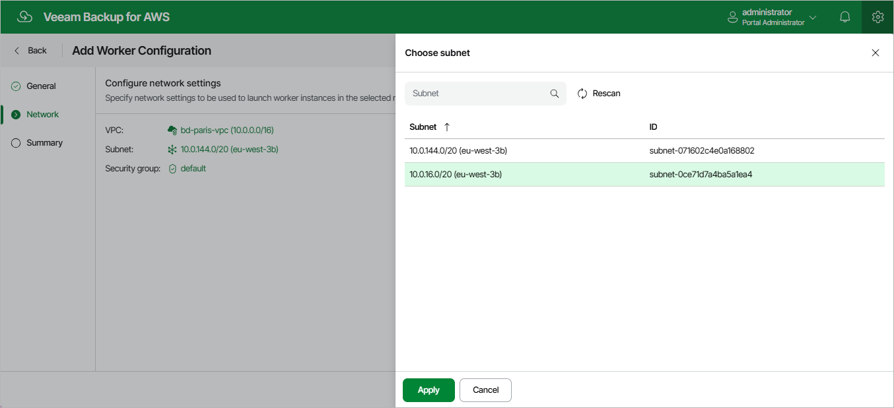

In this article

At the Network step of the wizard, select an Amazon VPC network and a subnet to which you want to connect worker instances, and specify a security group that must be associated with the instances. For an Amazon VPC network, a subnet and a security group to be displayed in the lists of available network specifications, they must be created in AWS as described in [AWS Documentation](https://docs.aws.amazon.com/vpc/latest/userguide/what-is-amazon-vpc.html).

Veeam Backup for AWS will apply the specified network settings to all worker instances that will be deployed in the AWS Region and Availability Zone selected at the General step of the wizard.

|  |
| --- |
| Important |
| * Security rules configured in the selected security group must allow direct network traffic required to communicate with [AWS services](system_requirements_aws_services.md). To learn how to add rules to security groups, see [AWS Documentation](https://docs.aws.amazon.com/vpc/latest/userguide/VPC_SecurityGroups.html#AddRemoveRules). * Proxy redirect and setting a proxy in the Veeam Backup for AWS configuration are not supported. |

By default, Veeam Backup for AWS uses public access to communicate with worker instances. That is why the public IPv4 addressing attribute must be enabled for the selected subnet, the selected VPC network must have an internet gateway attached, and the VPC network and subnet route tables must have routes that direct internet-bound traffic to this internet gateway. If you want worker instances to operate in a private network, do either of the following:

* Enable the private network deployment functionality, and configure specific VPC endpoints for the subnet to let Veeam Backup for AWS use private IPv4 addresses as described in section [Configuring Private Network Deployment](enable_private_network_deployment.md).

For the list of specific endpoints required to perform backup and restore operations, see [Configuring Private Networks](configuring_private_networks.md).

* Configure VPC endpoints as described in section [Appendix C. Configuring Endpoints in AWS](configure_endpoints.md).

Page updated 8/11/2025

Page content applies to build 10.0.0.232
