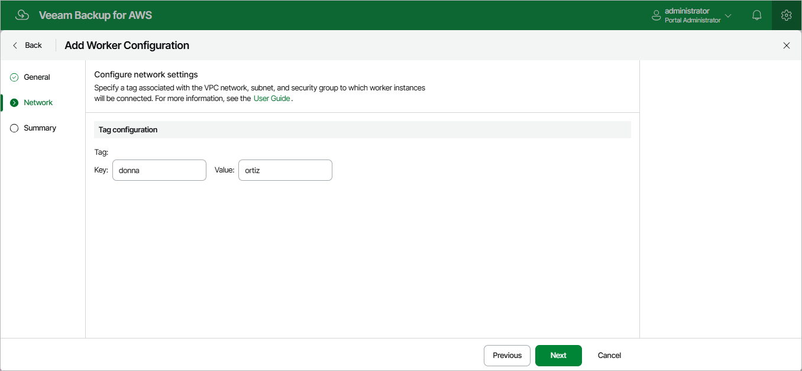

In this article

At the Network step of the wizard, do the following:

* If you have selected the Account option at [step 2](worker_configuration_general_prod.md#region) of the wizard, specify an Amazon VPC network and a subnet to which you want to connect worker instances deployed based on the new worker configuration, and choose a security group that will be associated with the instances.

For an Amazon VPC network, a subnet and a security group to be displayed in the lists of available network specifications, it must be created in the selected AWS Region as described in [AWS Documentation](https://docs.aws.amazon.com/vpc/latest/userguide/what-is-amazon-vpc.html).

* If you have selected the Organization option at step 2 of the wizard, specify the key and value of the AWS tag associated with the security group, VPC network and subnet to which you want to connect worker instances deployed based on the new worker configuration.

The network specifications with the specified tag must be created in each AWS account and each AWS Regions within the selected AWS Organization, as described in [AWS Documentation](https://docs.aws.amazon.com/vpc/latest/userguide/what-is-amazon-vpc.html).

Veeam Backup for AWS will apply the specified network settings to all worker instances that will be deployed based on the new worker configuration. For EFS indexing, Veeam Backup for AWS will also apply these settings to worker instances deployed to process file systems that have mount targets in the selected VPC network.

|  |
| --- |
| Important |
| * Proxy redirect and setting a proxy in the Veeam Backup for AWS configuration are not supported. * [Applies only to worker instances used for EC2 and RDS backup and restore operations] The selected security group must allow outbound access on port 443 required to communicate with [AWS services](system_requirements_aws_services.md).  * [Applies only to worker instances used for EFS indexing] The selected security group must allow outbound access on ports 2049 and 443. These ports are used by worker instances to mount file systems and to communicate with [AWS services](system_requirements_aws_services.md).   Note that the Enable DNS resolution option must be specified in the Amazon VPC console for the selected VPC network. For more information, see [AWS Documentation](https://docs.aws.amazon.com/vpc/latest/userguide/vpc-dns.html). |

By default, Veeam Backup for AWS uses public access to communicate with worker instances. That is why the [public IPv4 addressing](https://docs.aws.amazon.com/vpc/latest/userguide/working-with-subnets.html#subnet-public-ip) attribute must be enabled for the selected subnet, the selected VPC network must have an [internet gateway attached](https://docs.aws.amazon.com/vpc/latest/userguide/VPC_Internet_Gateway.html), and the VPC network and subnet route tables must have routes that direct internet-bound traffic to this internet gateway. If you want worker instances to operate in a private network, do either of the following:

* Enable the private network deployment functionality, and configure specific VPC endpoints for the subnet to let Veeam Backup for AWS use private IPv4 addresses as described in section [Configuring Private Network Deployment](enable_private_network_deployment.md).

For the list of specific endpoints required to perform backup and restore operations, see [Configuring Private Networks](configuring_private_networks.md).

* Configure VPC endpoints as described in section [Appendix C. Configuring Endpoints in AWS](configure_endpoints.md).

Page updated 1/5/2026

Page content applies to build 10.0.0.232
