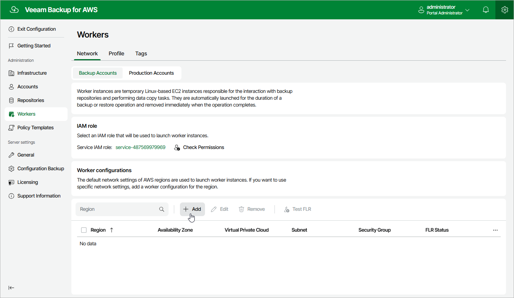

In this article

To launch the Add Worker Configuration wizard, do the following:

1. Switch to the Configuration page.
2. Navigate to Workers > Network.
3. In the Worker configurations section, click Add.

Page updated 7/4/2025

Page content applies to build 10.0.0.232
