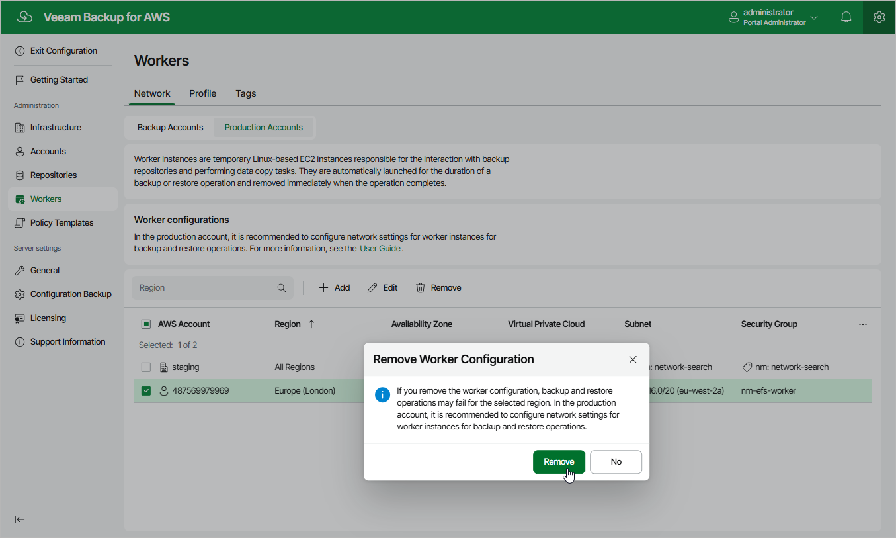

In this article

Veeam Backup for AWS allows you to permanently remove worker configurations if you no longer need them. When you remove a worker configuration, Veeam Backup for AWS does not remove currently running worker instances that have been created based on this configuration — these instances are removed only when the related operations complete.

To remove a worker configuration from Veeam Backup for AWS, do the following:

1. Switch to the Configuration page.
2. Navigate to Workers > Network.
3. Switch to the necessary tab.
4. Select the worker configuration and click Remove.

|  |
| --- |
| Note |
| If there are any worker instances created based on the selected configuration that are currently involved in a backup or restore process, these instances will be removed only when the process completes. |

Page updated 7/4/2025

Page content applies to build 10.0.0.232
