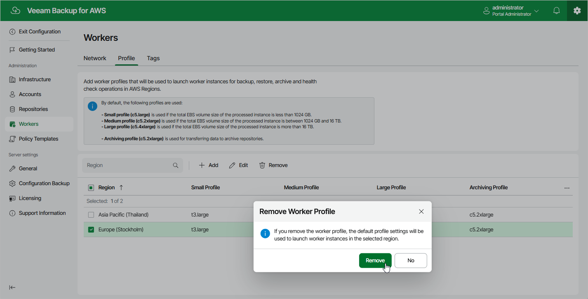

In this article

Veeam Backup for AWS allows you to permanently remove sets of worker profiles if you no longer need them. When you remove a profile set, Veeam Backup for AWS does not remove currently running worker instances that have been created based on this set — these instances are removed only when the related operations complete.

To remove a profile set from Veeam Backup for AWS, do the following:

1. Switch to the Configuration page.
2. Navigate to Workers > Profile.
3. Select the profile set and click Remove.

Page updated 1/13/2026

Page content applies to build 10.0.0.232
