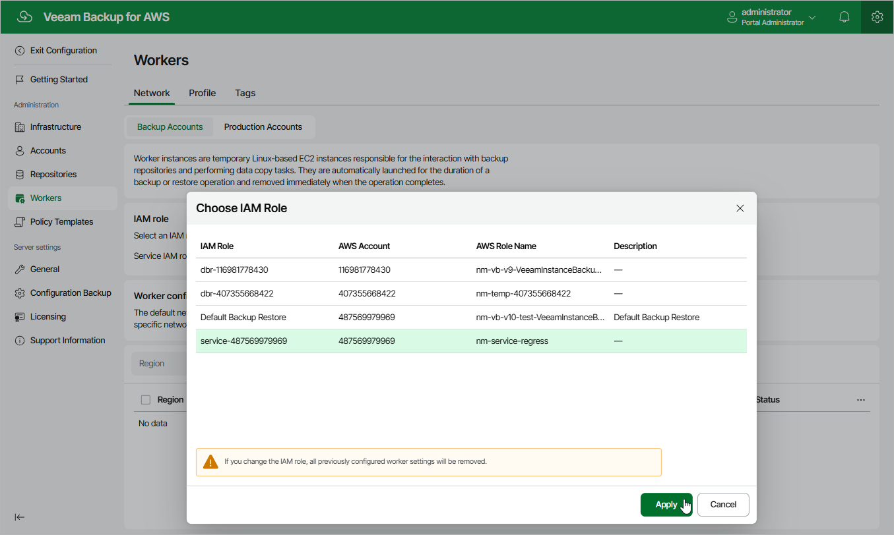

In this article

Out of the box, Veeam Backup for AWS uses the permissions of the Default Backup Restore role to deploy worker instances — the role is preconfigured and has all the required permissions. Therefore, the default backup account is an AWS account to which the backup appliance belongs. However, you can specify another IAM role to change the backup account.

To specify an IAM role for worker instances, do the following:

1. Switch to the Configuration page.

1. Navigate to Workers > Network.

1. At the Backup Accounts tab, click the link next to the Service IAM role field.

1. In the Choose IAM Role window, select the necessary IAM role, and then click Apply. The role you specify must be assigned the permissions listed in section [Worker Deployment Role Permissions in Backup Account](role_permissions_backup_acc.md).

For an IAM role to be displayed in the list of available IAM roles, it must be added to Veeam Backup for AWS as described in section [Adding IAM Roles](iam_roles_add.md).

|  |
| --- |
| Important |
| * After you choose an IAM role, it is not recommended to change it. Otherwise, all the created worker configurations will be removed automatically as soon as you choose another IAM role. * It is recommended that you check whether the selected IAM role has all the permissions required to deploy worker instances. If some permissions of the IAM role are missing, backup and restore operations will fail to complete successfully. To run the IAM role permission check, click Check Permissions and follow the instructions provided in section [Checking IAM Role Permissions](iam_roles_check.md). |

Page updated 7/4/2025

Page content applies to build 10.0.0.232
