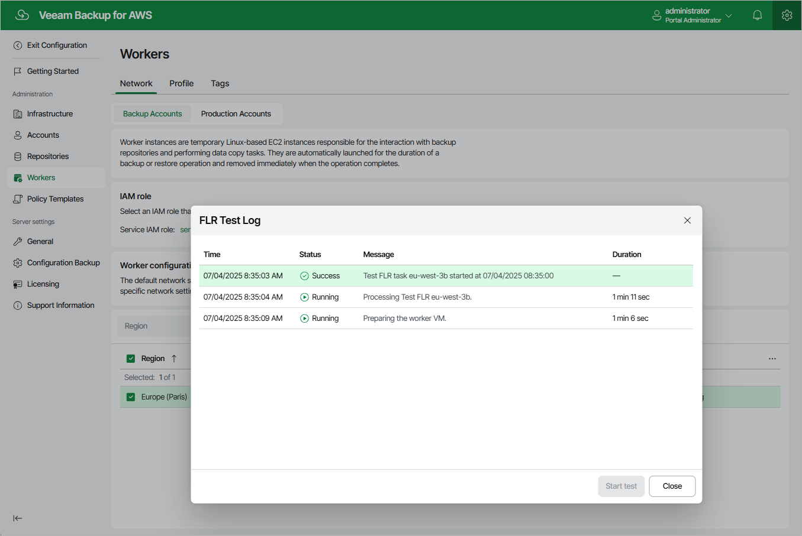

In this article

When performing [file-level recovery](restore_item_perform.md) for an EC2 instance, Veeam Backup for AWS deploys a worker instance, attaches and mounts EBS volumes of the EC2 instance to the worker instance and launches file-level recovery browser to allow users to browse, download and restore files and folders. To make sure whether worker network settings are configured properly, and the file-level recovery browser is accessible from your local machine, it is recommended that you run a file-level recovery test before you start file-level recovery operations in an AWS Region.

To run the file-level recovery test for a specific region, do the following:

1. Switch to the Configuration page.

1. Navigate to Workers > Network.

1. In the Worker configurations section, select the necessary configuration, and then click Test FLR.

1. Wait until the status of the file-level recovery test in the FLR Status column changes to Running, and then click the status.

Veeam Backup for AWS will display the FLR Test Log window where you can track the progress and view the results of the test.

1. If network settings are configured properly for the AWS Region, Veeam Backup for AWS will deploy the worker instance and display the link to the file-level recovery browser in the FLR Test Log window.

1. To check that you can access the file-level recovery browser, click the displayed link.

Note that the security group associated with worker instances must allow inbound internet access from the machine from which you plan to open the file-level recovery browser.

1. To finish the file-level recovery test, click End Test in the file-level recovery browser.

If you do not click End Test within 30 minutes after Veeam Backup for AWS displays the link to the file-level recovery browser, the file-level recovery test will finish automatically with the Warning status.

|  |
| --- |
| Tip |
| If the file-level recovery test finishes with the Warning or Error status, you can run the test again after fixing issues with the network settings. To do that, select the necessary configuration in the Worker configurations section, and then click Test FLR. |

Page updated 7/4/2025

Page content applies to build 10.0.0.232
