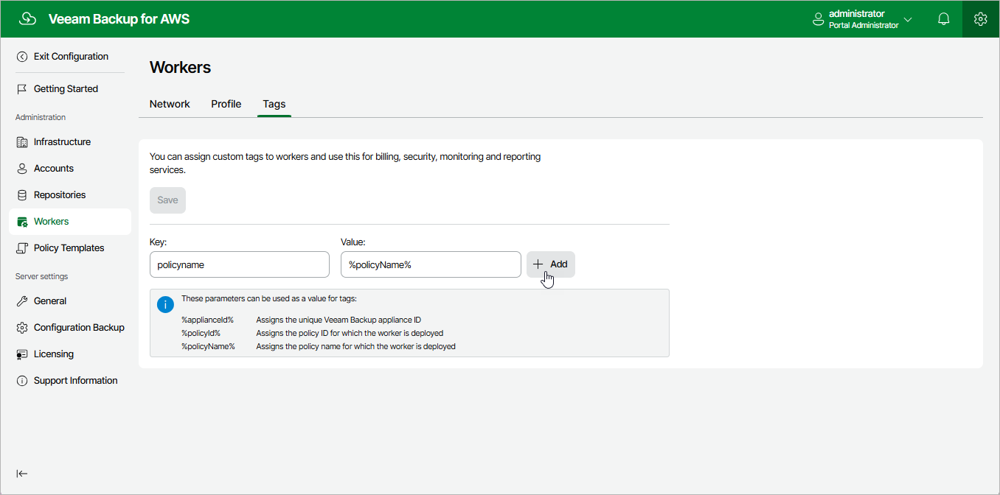

In this article

For all worker instances that are deployed in specific AWS Regions for the duration of backup, restore and retention processes, you can assign custom AWS tags, which may help you differentiate worker instances that have the same or similar names:

1. Switch to the Configuration page.

1. Navigate to Workers > Tags.
2. Use the Key and Value fields to specify a key and a value for a new custom AWS tag, and then click Add. Note that you cannot add more than 25 custom AWS tags.

Consider the following limitations:

* The maximum length of the tag key is 128 characters.
* The maximum length of the tag value is 256 characters.
* The aws: prefix is reserved for AWS use and cannot be added.

For more information on tag limitations, see [AWS Documentation](https://docs.aws.amazon.com/AWSEC2/latest/UserGuide/Using_Tags.html#tag-restrictions).

1. Click Save.

|  |
| --- |
| Tip |
| You can use a number of runtime variables as tag values to allow Veeam Backup for AWS to automatically fill in specific information for worker instances deployed during data protection operations. However, for worker instances deployed during restore operations, retention tasks, configuration checks and FLR tests, the values of the %policyid% and %policyName% variables will be replaced with operation names. |

Page updated 7/4/2025

Page content applies to build 10.0.0.232
